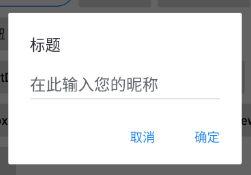

## QMUI Android

> 2020-04-28
>
> Android studio 3.6.2 
>
> QMUI 2.0.0-alpha07

来自腾讯的开源Android ui框架

[官方地址](https://qmuiteam.com/android)   [Wiki地址](https://github.com/Tencent/QMUI_Android/wiki)

### 引入方法

1. 在 app/build.gradle中引入

```groovy
 implementation 'com.qmuiteam:qmui:2.0.0-alpha07'
```

2. 配置主题

把项目的`theme`的`parent`指向`QMUI.Compat`。

`theme`位置在 app/main/AndroidManifest.xml中

3. 覆盖组件的默认表现

可以通过在项目中的 `theme` 中用 `(value)` 的形式来覆盖 QMUI 组件的默认表现。具体可指定的属性名请参考 `@style/QMUI.Compat` 或 `@style/QMUI` 中的属性。


### QMUITopBar 使用

`QMUITopBar`可以作为 App 通用的顶部Bar，提供了以下功能：

1. 在 左侧/右侧 添加 图片按钮/文字按钮/自定义View
2. 设置 标题/副标题，且支持设置 标题/副标题的水平对齐方式。

#### xml 属性

> 为官方viki给出 但很多方法疑似被删除

| 属性名                                                | 描述                                                         |
| ----------------------------------------------------- | ------------------------------------------------------------ |
| qmui_topbar_title_gravity                             | 标题的水平对齐方式                                           |
| qmui_topbar_need_separator                            | 是否需要底部分隔线                                           |
| qmui_topbar_separator_color                           | 底部分隔线的颜色                                             |
| qmui_topbar_separator_height                          | 底部分隔线的高度                                             |
| qmui_topbar_bg_color                                  | 背景色                                                       |
| qmui_topbar_left_back_drawable_id                     | 左侧返回按钮的图片 drawableResId                             |
| qmui_topbar_title_text_size                           | 标题的字号大小                                               |
| qmui_topbar_title_text_size_with_subtitle             | 存在副标题时的标题字号大小                                   |
| qmui_topbar_subtitle_text_size                        | 副标题字号大小                                               |
| qmui_topbar_title_color                               | 标题文字颜色                                                 |
| qmui_topbar_subtitle_color                            | 副标题文字颜色                                               |
| qmui_topbar_title_margin_horizontal_when_no_btn_aside | 标题左右无按钮时标题与 TopBar 左右边缘的距离                 |
| qmui_topbar_title_container_padding_horizontal        | 标题左右的内间距(长标题时可见效果)                           |
| qmui_topbar_image_btn_width                           | 左右图片按钮的宽度                                           |
| qmui_topbar_image_btn_height                          | 左右图片按钮的高度                                           |
| qmui_topbar_text_btn_padding_horizontal               | 左右文字按钮的水平内间距(文字按钮的宽度由文字宽度+该左右padding决定) |
| qmui_topbar_text_btn_color_state_list                 | 左右文字按钮的颜色                                           |
| qmui_topbar_text_btn_text_size                        | 左右文字按钮的字号大小                                       |

各个属性的默认样式配置见 [qmui_style_widget.xml](https://github.com/Tencent/QMUI_Android/blob/master/qmui/src/main/res/values/qmui_style_widget.xml#L85)


#### 主要方法

| 方法名                                                       | 描述                                                         |
| ------------------------------------------------------------ | ------------------------------------------------------------ |
| addLeftBackImageButton()                                     | 在 TopBar 左边添加一个返回图标按钮，返回图标图片由 xml 属性 `qmui_topbar_left_back_drawable_id` 指定 |
| addLeftImageButton(int drawableResId, int viewId)、addRightImageButton(int drawableResId, int viewId) | 根据 resourceId 在 TopBar 左右添加一个图片按钮               |
| addLeftTextButton(int stringResId, int viewId)、addRightTextButton(int stringResId, int viewId) | 在 TopBar 左右添加一个文字按钮                               |
| addLeftView(View view, int viewId, LayoutParams layoutParams)、addRightView(View view, int viewId, LayoutParams layoutParams) | 在 TopBar 左右添加自定义 View。如果是图片按钮或文字按钮,可通过 generateTopBarImageButtonLayoutParams() 和 generateTopBarTextButtonLayoutParams() 方法创建 LayoutParams |
| setTitle(int resId) 、setTitle(String title)                 | 设置标题文字                                                 |
| setSubTitle(int resId)、setSubTitle(String subTitle)         | 设置副标题文字                                               |
| setTitleGravity(int gravity)                                 | 设置标题、副标题的对齐方式                                   |
| showTitleView(boolean toShow)                                | 切换标题、副标题的显示/隐藏                                  |
| setCenterView(View view)                                     | 设置自定义 View 到 TopBar 中间                               |
| removeAllLeftViews()、removeAllRightViews()                  | 移除 TopBar 左右所有的 View                                  |
| removeCenterViewAndTitleView()                               | 移除 TopBar 的 centerView 和 titleView                       |
| setBackgroundAlpha(int alpha)                                | 设置背景透明度(包括分割线，因为分割线依附于背景 Drawable)    |
| setBackgroundDividerEnabled(boolean enabled)                 | 设置底部分隔线的显示/隐藏                                    |
| computeAndSetBackgroundAlpha(int currentOffset, int alphaBeginOffset, int alphaTargetOffset) | 根据传入的三个值(当前值、初始值、最终值)计算决定 TopBar 的背景透明度 |


#### 使用样例

创建一个Activity，注意要继承Activity，目前版本的 Android studio 创建的Activity 默认继承AppCompatActivity，这导致页面会因为继承问题出现ToolBar的问题。

在Activity的xml中加入

```xml
<com.qmuiteam.qmui.widget.QMUITopBar
         android:id="@+id/QmTopBar"
         android:layout_width="match_parent"
         android:layout_height="wrap_content"
         />
```

然后在Activity的java方法中创建一个初始化TopBar的方法：

```java
public void initTopBar(){
        QMUITopBar qmuiTopBar = findViewById(R.id.QmTopBar);
        qmuiTopBar.setTitle("QMTopBarDemo主标题");
        QMUIAlphaImageButton imageButton = qmuiTopBar.addLeftBackImageButton();
        qmuiTopBar.setSubTitle("这是副标题");
    }
```

最后在`onCreate`方法或其他调用方式调用一下，就会出现一个TopBar，如图。


需要注意的是，这个返回按钮默认是没有功能的，需要我们给他添加一个点击监听事件。


### QMUIDialog 使用

`QMUIDialog` 提供了一系列常用的对话框，解决了系统默认对话框在不同 Android 版本上的表现不一致的问题。

`QMUIDialog` 一般使用 `QMUIDialogBuilder` 及其子类来创建。


#### 基类 Builder 及其提供的通用方法

各种类型的 Builder 都应该继承 `QMUIDialogBuilder`，该类提供一些通用的方法。

- 类: [`QMUIDialogBuilder`](https://github.com/Tencent/QMUI_Android/blob/master/qmui/src/main/java/com/qmuiteam/qmui/widget/dialog/QMUIDialogBuilder.java)
- 主要方法

| 方法名                                                       | 描述                                                         |
| ------------------------------------------------------------ | ------------------------------------------------------------ |
| setTitle(String title)                                       | 设置对话框的标题                                             |
| hasTitle()                                                   | 返回对话框是否拥有标题                                       |
| setCanceledOnTouchOutside(boolean canceledOnTouchOutside)    | 设置点击 Dialog 外部时是否关闭 Dialog                        |
| setOnDecorationListener(QMUIDialogView.OnDecorationListener onDecorationListener) | 设置 Dialog 的 View 的 `onDraw()` 与 `dispatchDraw()` 回调   |
| addAction(QMUIDialogAction action)                           | 添加按钮                                                     |
| addAction(CharSequence str, QMUIDialogAction.ActionListener listener) | 添加按钮和点击事件                                           |
| setActionContainerOrientation(int actionContainerOrientation) | 设置按钮区域的排列方向(`QMUIDialogBuilder.HORIZONTAL` / `QMUIDialogBuilder.VERTICAL`) |
| setChangeAlphaForPressOrDisable(boolean changeAlphaForPressOrDisable) | 设置点击按钮时、按钮不可点时是否要改变透明度                 |
| setActionDivider(int thickness, int colorRes, int startInset, int endInset) | 设置按钮之前的分割线宽度、颜色、起始位置缩进、结束位置缩进   |
| show()                                                       | 生成一个 QMUIDialog，并显示出来                              |
| create()                                                     | 生成一个 QMUIDialog，但不显示出来                            |
| create(int style)                                            | 根据 style 样式生成一个 QMUIDialog，但不显示出来             |

- 自定义 Builder 时可继承的方法

| 方法名                                                       | 描述                                                         |
| ------------------------------------------------------------ | ------------------------------------------------------------ |
| onConfigTitleView(TextView titleView)                        | 对标题(`TextView`) 进行自定义修改，在标题 View 创建之后调用  |
| onCreateContent(QMUIDialog dialog, ViewGroup parent, Context context) | 创建标题以下、按钮以上部分的 View，并添加到 parent 中        |
| onAfter(QMUIDialog dialog, LinearLayout parent, Context context) | 对 Dialog 进行整体自定义修改，在 Dialog 的 View 创建完毕、未显示出来之前调用 |


> 常见的几种官方预制样式

#### 对话框

- 类: `QMUIDialog.MessageDialogBuilder`
- 主要方法

| 方法名                           | 描述               |
| -------------------------------- | ------------------ |
| setMessage(CharSequence message) | 设置对话框的提示语 |

> 使用

```java
new QMUIDialog.MessageDialogBuilder(this)
                .setTitle("标题")
                .setMessage("这是一串内容")
                .addAction("取消", new QMUIDialogAction.ActionListener() {
                    @Override
                    public void onClick(QMUIDialog dialog, int index) {
                        dialog.dismiss();
                    }
                })
                .addAction("确定", new QMUIDialogAction.ActionListener() {
                    @Override
                    public void onClick(QMUIDialog dialog, int index) {
                        dialog.dismiss();
                    }
                })
                .show();
```

> 运行结果


#### 带 CheckBox 的消息确认框

- 类: `QMUIDialog.CheckBoxMessageDialogBuilder`'
- 主要方法

| 方法名                           | 描述                     |
| -------------------------------- | ------------------------ |
| setMessage(CharSequence message) | 设置对话框的提示语       |
| setChecked(boolean checked)      | 设置 CheckBox 勾选状态   |
| isChecked()                      | 获取 CheckBox 是否被勾选 |

> 使用

``` java
final QMUIDialog.CheckBoxMessageDialogBuilder builder =   new QMUIDialog.CheckBoxMessageDialogBuilder(getActivity());

        builder.setTitle("退出后是否删除账号信息?")
                .setMessage("删除账号信息")
                .setChecked(true)
                .addAction("取消", new QMUIDialogAction.ActionListener() {
                    @Override
                    public void onClick(QMUIDialog dialog, int index) {
                        dialog.dismiss();
                    }
                })
                .addAction("确定", new QMUIDialogAction.ActionListener() {
                    @Override
                    public void onClick(QMUIDialog dialog, int index) {
                        Toast.makeText(getActivity(),builder.isChecked()?"删除":"不删除",Toast.LENGTH_LONG).show();
                        dialog.dismiss();
                    }
                })
                .show();
```

_这里有一点要注意，先通过new的方式获取builder的对象，然后再设置属性，这样可以在方法体中读取到checkbox的值。_

> 运行


#### 带输入框的对话框

- 类: `QMUIDialog.EditTextDialogBuilder`'
- 主要方法

| 方法名                                   | 描述                       |
| ---------------------------------------- | -------------------------- |
| setPlaceholder(String placeholder)       | 设置输入框的 placeholder   |
| setDefaultText(CharSequence defaultText) | 设置输入框的默认文字       |
| setInputType(int inputType)              | 设置 EditText 的 inputType |

> 使用

```java
final QMUIDialog.EditTextDialogBuilder builder = new QMUIDialog.EditTextDialogBuilder(getActivity());
        builder.setTitle("标题")
                .setPlaceholder("在此输入您的昵称")
                .setInputType(InputType.TYPE_CLASS_TEXT)
                .addAction("取消", new QMUIDialogAction.ActionListener() {
                    @Override
                    public void onClick(QMUIDialog dialog, int index) {
                        dialog.dismiss();
                    }
                })
                .addAction("确定", new QMUIDialogAction.ActionListener() {
                    @Override
                    public void onClick(QMUIDialog dialog, int index) {
                        CharSequence text = builder.getEditText().getText();
                        if (text != null && text.length() > 0) {
                            Toast.makeText(getActivity(), "您的昵称: " + text, Toast.LENGTH_SHORT).show();
                            dialog.dismiss();
                        } else {
                            Toast.makeText(getActivity(), "请填入昵称", Toast.LENGTH_SHORT).show();
                        }
                    }
                })
                .show();
```

> 运行



