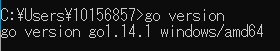
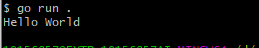

# 开始

> 第一步 安装Go的开发环境

[官方](golang.org)下载安装包或者去[中文网](studygolang.com)下载对应系统的包，安装并配置环境，在命令行界面输入`go version`如果显示对应版本号，说明安装成功。



> 第二步 Hello World

在文件夹中新建一个文件`main.go`，写入

```go
package main

import "fmt"

func main(){
    fmt.Pringtln("Hello World!")
}
```

执行`go run main.go`或者`go run .`，即可看到输出。



**如果强制启用的Go Modules机制，即环境变量中设置了GO111MODULE=on，则需要先初始化模块`go mod init hello`，否则会报错**

